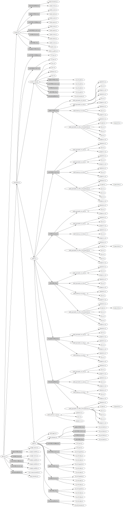

# Build Code For Different Users Bases
The build.py file in the folder will build code for different user bases.  The public version is created in the /public folder and the CCF version is created in the /ccf folder.  The public version is also copied to the main repository folder.

## /build folder
The build.py file uses python to construct .SAS files for different users bases.  The parts used for building are included in the /parts folder.  The build tree looks like:

### Import Types
The build process has logic for the following types of imports.  
- X_IMPORT: import for the CCF and Public versions of the code
- P_IMPORT: import for the public version of the code
- C_IMPORT: import for the CCF version of the code with just DS SIR method
- D_IMPORT: import for the CCF version of the ocde with all methods
- T_IMPORT: import for the test version of the code - used to try new features before making available to users (public or ccf)
- U_IMPORT: import for the UI version of the code
- V_IMPORT: import for the UI version of the code for public version of the UI (no import of data)

The logic setup recursively calls parts while honoring a hierarchy of inclusion: 
- Once a C_IMPORT part is called, all further import types are only written to C_IMPORT destinations
- Once a U_IMPORT part is called, all further import types are only written to U_IMPORT destinations
- Once a P_IMPORT part is called, all further import types are only written to P_IMPORT and X_IMPORT destinations
- Once a T_IMPORT part is called, all further import type sare only written to T_IMPORT destinations
