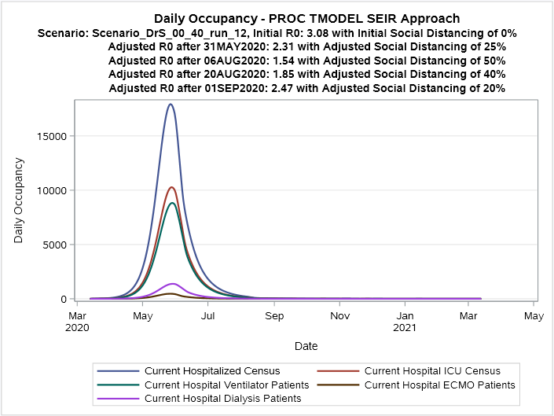
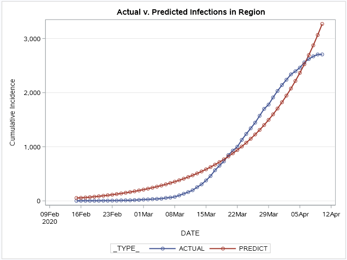
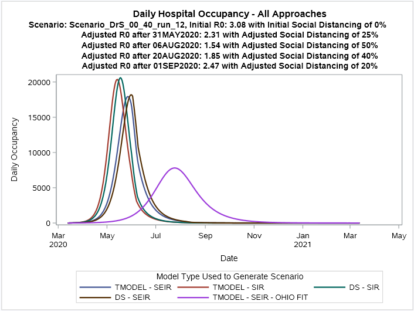

# covid-19-sas

This is a collaboration space for SAS and others to understand, model, and mitigate COVID-19 through analytics.

## SIR & SEIR Modeling (with CCF)

This first entry is a collaboration between the Cleveland Clinic and SAS Institute. Explore [the /CCF folder](./CCF)
for code and documentation about the model implementation.

### Outputs from sample scenarios

