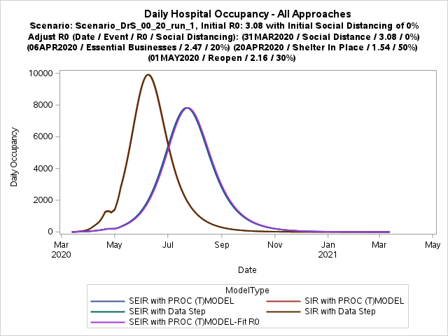
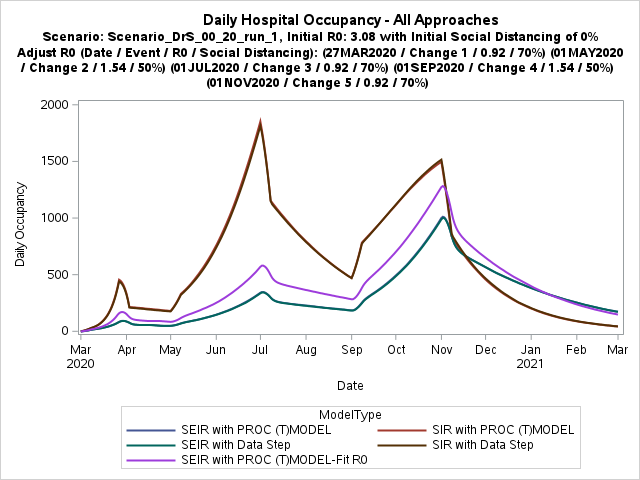

# COVID-19 Epidemiological Scenario and Critical Resource Utilization Prediction Program

This is a collaboration space for SAS and others to understand, model, and mitigate COVID-19 through analytics. The projects here include:

* [SIR & SEIR Modeling (with Cleveland Clinic)](#sir--seir-modeling-with-cleveland-clinic)
* [Data sources for COVID-19 reporting](#data-sources-for-covid-19-reporting)

To use the work in these projects, a SAS environment is required.  Refer to the documentation for each project to learn more about the SAS system requirements.

---

## SIR & SEIR Modeling (with Cleveland Clinic)

This first entry is a collaboration between the Cleveland Clinic and SAS Institute. Explore [the /CCF folder](./CCF) for code and documentation about the model implementation.
    
## How to experience this project and learn more

There are number of ways in which you can interact with this project:

### SAS Global Forum 2020 presentation 

Experts from Cleveland Clinic and SAS will present about this project and its impact during SAS Global Forum (virtual, online) on June 16, 2020.  [Visit the event site to register](https://www.sas.com/en_us/events/sas-global-forum/agenda.html) or to view the on-demand presentation after the event.

### A Boemska powered SAS Viya App

Front line ER physician and Co-Creator of the Netflix series Pandemic, Ryan McGarry MD, had this to say when [he spoke to SAS' Alyssa Farrell at this year's SAS Global Forum Executive Connection](https://www.sas.com/en_us/events/sas-global-forum/analytics-executive.html):

> "You can come with me any day, and I'll show you all the ways that you can help clinical front line staff - as far as just the interfaces that we work with. There's so much room for improvement here, I'm not even sure we have enough time to cover it all. Of all areas of the world, how is it that healthcare seems to be so far behind on the front line in terms of interface, and particularly the user experience?" 

This project implements an alternative interface to the same resource optimisation & forecasting code that powers the Visual Analytics-based CCF application in this repository. It is not as full-featured as the Visual Analytics interface, instead it focuses on simplicity, minimal load time, and context switching efficiency.

Usability within a clinical setting is a primary consideration. The interface and its components are designed for [stylus-based interaction](https://ieeexplore.ieee.org/document/4588449). The app is designed to be usable while wearing gloves/PPE, and to run on easy-to-sterilize devices (i.e. tablets). While the design primarily targets iPad and Apple Pencil, the app will work just as well on similar Android, Windows or ChromeOS stylus-enabled devices. It is shown here running on a 10.5" 2017 iPad Pro. 

### Interactive Visual Analytics interface hosted by SAS

This project is also the engine for an [interactive visual interface that is hosted by SAS](https://www.sas.com/en_us/trials/software/epidemiological-scenario-analysis/form.html), available now.  The web-based interface does not require a local SAS environment.

### Outputs from sample scenarios

Among other outputs, these analyses will create diagnostic visuals for each modeled scenario.

|  |  |  |
:-------------------------:|:-------------------------:|:-------------------------:
  |    |  
  |    |  

---

## Data sources for COVID-19 reporting

SAS developers and data scientists maintain a [Coronavirus Dashboard Report](https://www.sas.com/covid19) using SAS Visual Analytics.
The dashboard is refreshed daily with new data from several public data sources.  [In the /Data folder](./Data), the team has shared
the SAS programs that are used to retrieve and prepare this data for reporting.

---

## Preferred Reference for Citation

Cleveland Clinic and SAS COVID-19 Development Team. Developer Documentation [Internet]. 2020. Available from: https://github.com/sassoftware/covid-19-sas
